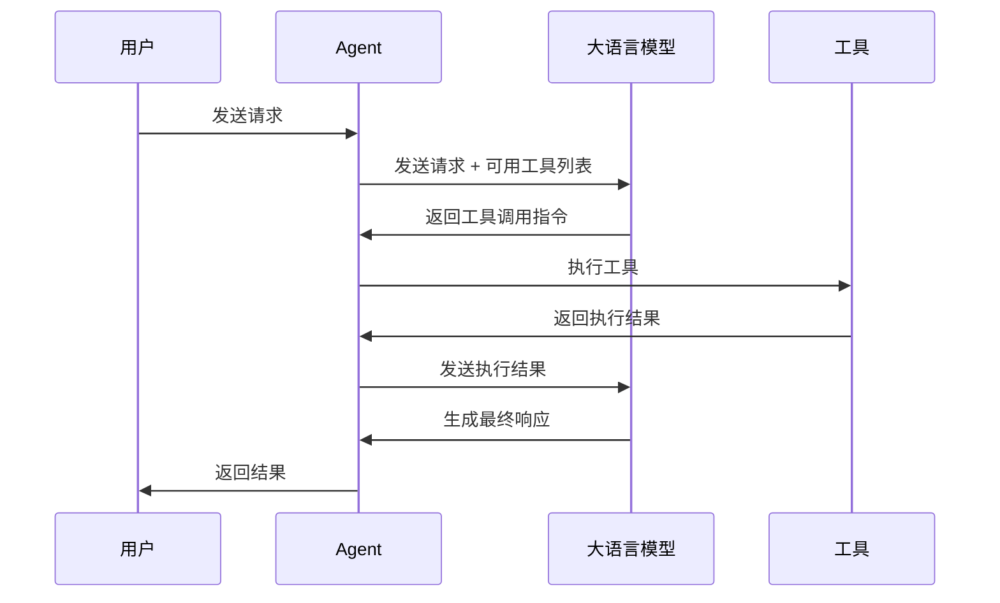
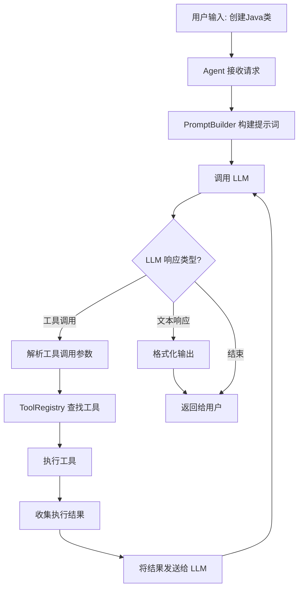

# Code Agent 设计文档

## 目录

1. [概述](#1-概述)
2. [Agent 原理详解](#2-agent-原理详解)
3. [系统架构](#3-系统架构)
4. [核心组件设计](#4-核心组件设计)
5. [工作流程](#5-工作流程)
6. [技术实现](#6-技术实现)
7. [扩展设计](#7-扩展设计)

---

## 1. 概述

### 1.1 项目背景

随着大语言模型（LLM）的快速发展，AI 辅助编程工具如 Cursor、Claude Code 等已经成为开发者的重要助手。这些工具的核心是 **Agent（智能代理）** 技术，它能够理解用户的自然语言描述，并自动生成对应的代码。

本项目旨在实现一个简化版的 Code Agent，帮助开发者理解 Agent 的工作原理，并提供一个可扩展的基础框架。

### 1.2 项目目标

- **教育目的**：让开发者理解 Agent 的核心原理和实现方式
- **实用性**：提供一个可以实际运行的命令行代码生成工具
- **可扩展性**：设计模块化架构，便于后续功能扩展

### 1.3 功能范围

**当前版本支持**：
- 通过自然语言描述生成新代码
- 对已有代码的精确编辑（搜索替换）和批量替换
- 支持多种编程语言（Java、Python、JavaScript 等）
- 多轮对话上下文（滑动窗口记忆）
- 双模式交互：Agent 模式（工具调用）和 Ask 模式（流式问答）
- LLM 调用自动重试（指数退避）
- 命令行交互界面
- 代码文件保存

---

## 2. Agent 原理详解

### 2.1 什么是 Agent？

**Agent（智能代理）** 是一种能够自主执行任务的 AI 系统。与传统的问答式 AI 不同，Agent 具备以下特点：

```
┌─────────────────────────────────────────────────────────────────┐
│                        Agent 核心特征                            │
├─────────────────────────────────────────────────────────────────┤
│  1. 感知 (Perception)    - 理解用户输入和环境状态                  │
│  2. 推理 (Reasoning)     - 分析任务，制定执行计划                  │
│  3. 行动 (Action)        - 调用工具执行具体操作                    │
│  4. 反馈 (Feedback)      - 观察结果，调整后续行为                  │
└─────────────────────────────────────────────────────────────────┘
```

### 2.2 Agent 与普通 LLM 的区别

| 特性 | 普通 LLM | Agent |
|------|----------|-------|
| 交互方式 | 单次问答 | 多步骤任务执行 |
| 能力边界 | 仅文本生成 | 可调用外部工具 |
| 状态管理 | 无状态 | 有状态，可记忆上下文 |
| 执行能力 | 只能建议 | 可实际执行操作 |
| 自主性 | 被动响应 | 主动规划和执行 |

### 2.3 Agent 的核心组成

一个完整的 Agent 系统包含以下核心组件：

```
                    ┌─────────────────┐
                    │   用户输入       │
                    │  (User Input)   │
                    └────────┬────────┘
                             │
                             ▼
┌────────────────────────────────────────────────────────────┐
│                      Agent 核心                            │
│  ┌──────────────────────────────────────────────────────┐  │
│  │                   大语言模型 (LLM)                    │  │
│  │           作为 Agent 的"大脑"进行推理决策              │  │
│  └──────────────────────────────────────────────────────┘  │
│                             │                              │
│              ┌──────────────┼──────────────┐               │
│              ▼              ▼              ▼               │
│  ┌───────────────┐ ┌───────────────┐ ┌───────────────┐     │
│  │  Prompt 模板   │ │   工具集合     │ │   记忆系统    │     │
│  │   (Prompts)   │ │   (Tools)     │ │   (Memory)   │     │
│  └───────────────┘ └───────────────┘ └───────────────┘     │
│                             │                              │
│              ┌──────────────┼──────────────┐               │
│              ▼              ▼              ▼               │
│  ┌───────────────┐ ┌───────────────┐ ┌───────────────┐     │
│  │  代码生成工具  │ │  文件操作工具  │ │  其他工具...   │     │
│  └───────────────┘ └───────────────┘ └───────────────┘     │
└────────────────────────────────────────────────────────────┘
                             │
                             ▼
                    ┌─────────────────┐
                    │   执行结果       │
                    │ (Output/Action) │
                    └─────────────────┘
```

### 2.4 Tool Calling（工具调用）机制

**Tool Calling** 是 Agent 的核心能力之一，它允许 LLM 调用外部工具来完成特定任务。

#### 2.4.1 工作原理

```
用户请求 → LLM 分析 → 选择工具 → 执行工具 → 返回结果 → LLM 总结
    │                    │            │           │
    │                    │            │           │
    ▼                    ▼            ▼           ▼
"帮我创建一个     LLM 决定需要    调用文件    文件创建成功
 Java 类"        使用代码生成    创建工具    返回路径
                 和文件写入工具
```

#### 2.4.2 Tool 的定义结构

每个 Tool 需要定义以下信息：

```json
{
  "name": "create_file",
  "description": "创建一个新文件并写入内容",
  "parameters": {
    "type": "object",
    "properties": {
      "file_path": {
        "type": "string",
        "description": "文件的完整路径"
      },
      "content": {
        "type": "string",
        "description": "要写入的文件内容"
      }
    },
    "required": ["file_path", "content"]
  }
}
```

#### 2.4.3 Tool Calling 流程



### 2.5 ReAct 模式与 Spring AI Tool Calling

#### 2.5.1 什么是 ReAct 模式？

**ReAct (Reasoning + Acting)** 是一种让 LLM 交替进行推理和行动的范式，由论文 "ReAct: Synergizing Reasoning and Acting in Language Models" 提出。

标准的 ReAct 循环包含三个步骤：
1. **Thought（思考）**：LLM 分析当前状态，决定下一步行动
2. **Action（行动）**：执行具体操作（如调用工具）
3. **Observation（观察）**：获取行动的结果

```
┌─────────────────────────────────────────────────────────────────┐
│                     ReAct 循环示意图                             │
├─────────────────────────────────────────────────────────────────┤
│                                                                 │
│    ┌──────────┐     ┌──────────┐     ┌──────────┐              │
│    │ Thought  │────▶│  Action  │────▶│Observation│             │
│    │  (思考)   │     │  (行动)   │     │  (观察)   │             │
│    └──────────┘     └──────────┘     └────┬─────┘              │
│         ▲                                  │                    │
│         │                                  │                    │
│         └──────────────────────────────────┘                    │
│                    (循环直到任务完成)                             │
│                                                                 │
└─────────────────────────────────────────────────────────────────┘
```

#### 2.5.2 Spring AI 如何实现 ReAct 模式

**重要理解**：Spring AI 的 Tool Calling 机制已经**内置实现**了 ReAct 模式的核心循环，开发者无需手动编写循环逻辑。

当使用 `ChatClient` 配置了 `defaultTools()` 后，Spring AI 会自动处理以下流程：

```
┌─────────────────────────────────────────────────────────────────┐
│              Spring AI Tool Calling 自动循环                     │
├─────────────────────────────────────────────────────────────────┤
│                                                                 │
│  用户请求                                                        │
│      │                                                          │
│      ▼                                                          │
│  ┌─────────────────────────────────────────────────────────┐    │
│  │  1. Spring AI 发送请求给 LLM（包含工具定义）              │    │
│  └─────────────────────────────────────────────────────────┘    │
│      │                                                          │
│      ▼                                                          │
│  ┌─────────────────────────────────────────────────────────┐    │
│  │  2. LLM 分析请求，决定是否调用工具 (Reasoning/Thought)    │    │
│  └─────────────────────────────────────────────────────────┘    │
│      │                                                          │
│      ├──── 返回 tool_calls ────┐                                │
│      │                         ▼                                │
│      │  ┌─────────────────────────────────────────────────┐     │
│      │  │  3. Spring AI 自动执行工具 (Acting/Action)       │     │
│      │  └─────────────────────────────────────────────────┘     │
│      │                         │                                │
│      │                         ▼                                │
│      │  ┌─────────────────────────────────────────────────┐     │
│      │  │  4. 工具结果自动发送回 LLM (Observation)          │     │
│      │  └─────────────────────────────────────────────────┘     │
│      │                         │                                │
│      │                         └──────▶ 返回步骤 2（继续循环）   │
│      │                                                          │
│      └──── 返回普通文本 ────┐                                    │
│                            ▼                                    │
│  ┌─────────────────────────────────────────────────────────┐    │
│  │  5. 返回最终响应给用户                                    │    │
│  └─────────────────────────────────────────────────────────┘    │
│                                                                 │
└─────────────────────────────────────────────────────────────────┘
```

#### 2.5.3 代码实现对比

**错误做法**：在 System Prompt 中要求 LLM 输出 `[Thought]/[Action]/[Observation]` 格式的文本

```java
// ❌ 错误：这只是让 LLM 输出特定格式的文本，不是真正的 ReAct
private static final String SYSTEM_PROMPT = """
    你必须按照以下格式进行思考和行动：
    [Thought]: [分析用户需求]
    [Action]: [描述要执行的操作]
    [Observation]: [观察操作结果]
    [Final Answer]: [给出最终回答]
    """;
```

这种做法的问题：
- `[Observation]` 是 LLM 自己生成的文本，不是真实的工具执行结果
- 可能干扰 Spring AI 的正常 Tool Calling 行为
- LLM 可能会"幻想"工具执行结果

**正确做法**：利用 Spring AI 的 Tool Calling 机制

```java
// ✅ 正确：让 Spring AI 自动处理 ReAct 循环
private static final String SYSTEM_PROMPT = """
    你是一个专业的代码生成助手。

    ## 你的能力
    你可以使用以下工具来完成任务：
    - createFile: 创建新的代码文件
    - readFile: 读取已有文件

    ## 工作方式
    1. 分析用户需求
    2. 如果需要，调用相应工具
    3. 根据工具结果给出回答
    """;

// 注册工具，Spring AI 会自动处理 Tool Calling 循环
this.chatClient = chatClientBuilder
    .defaultSystem(SYSTEM_PROMPT)
    .defaultTools(codeAgentTools)  // 关键：注册工具
    .build();
```

#### 2.5.4 Spring AI Tool Calling 的优势

| 特性 | 手动实现 ReAct | Spring AI Tool Calling |
|------|---------------|------------------------|
| 循环控制 | 需要手动编写 while 循环 | 框架自动处理 |
| 工具执行 | 需要解析 LLM 输出并手动调用 | 自动执行并返回结果 |
| 错误处理 | 需要手动处理各种异常 | 框架统一处理 |
| 多轮调用 | 需要手动管理上下文 | 自动维护对话上下文 |
| 代码复杂度 | 高 | 低 |

### 2.6 Prompt Engineering（提示词工程）

Prompt 是引导 LLM 行为的关键。一个好的 Agent Prompt 通常包含：

#### 2.6.1 System Prompt 结构

```
┌─────────────────────────────────────────────────────────────────┐
│                      System Prompt 结构                          │
├─────────────────────────────────────────────────────────────────┤
│  1. 身份定义 (Identity)                                          │
│     - 你是一个专业的代码生成助手                                   │
│     - 你擅长 Java、Python、JavaScript 等语言                      │
│                                                                 │
│  2. 能力边界 (Capabilities)                                      │
│     - 你可以生成代码、创建文件                                     │
│     - 你不能修改已有代码（当前版本）                                │
│                                                                 │
│  3. 行为准则 (Guidelines)                                        │
│     - 生成的代码应该符合最佳实践                                   │
│     - 包含必要的注释                                              │
│     - 遵循命名规范                                                │
│                                                                 │
│  4. 输出格式 (Output Format)                                     │
│     - 使用 markdown 代码块                                        │
│     - 指定文件路径和语言                                          │
│                                                                 │
│  5. 工具使用说明 (Tool Usage)                                    │
│     - 描述可用工具及其用途                                         │
│     - 说明何时应该使用哪个工具                                     │
└─────────────────────────────────────────────────────────────────┘
```

#### 2.6.2 Prompt 示例

```
你是一个专业的代码生成助手。你的任务是根据用户的描述生成高质量的代码。

## 你的能力
- 生成各种编程语言的代码（Java、Python、JavaScript、Go 等）
- 创建新的代码文件
- 解释代码逻辑

## 行为准则
1. 生成的代码应该简洁、可读、符合最佳实践
2. 必须包含必要的注释说明
3. 遵循各语言的命名规范
4. 考虑边界条件和错误处理

## 可用工具
你可以使用以下工具来完成任务：
- create_file: 创建新文件
- generate_code: 生成代码片段

当用户要求创建文件时，请使用 create_file 工具。
```

### 2.7 记忆系统（Memory）

Agent 的记忆系统用于保存上下文信息，使多轮对话更加连贯。

```
┌─────────────────────────────────────────────────────────────────┐
│                        记忆系统类型                              │
├─────────────────────────────────────────────────────────────────┤
│                                                                 │
│  短期记忆 (Short-term Memory)                                    │
│  ├── 当前会话的对话历史                                          │
│  └── 临时状态信息                                                │
│                                                                 │
│  长期记忆 (Long-term Memory)                                     │
│  ├── 用户偏好设置                                                │
│  ├── 历史项目信息                                                │
│  └── 学习到的模式                                                │
│                                                                 │
│  工作记忆 (Working Memory)                                       │
│  ├── 当前任务上下文                                              │
│  ├── 已执行的操作                                                │
│  └── 待完成的子任务                                              │
│                                                                 │
└─────────────────────────────────────────────────────────────────┘
```

#### 2.7.1 Spring AI ChatMemory 实现

本项目使用 Spring AI 内置的 `MessageWindowChatMemory` 实现对话记忆：

```java
// AiConfig.java 中配置 ChatMemory Bean
@Bean
public ChatMemory chatMemory() {
    return MessageWindowChatMemory.builder()
        .maxMessages(20)  // 滑动窗口大小
        .build();
}

// CodeAgent.java 中使用 MessageChatMemoryAdvisor
// 使用双 ChatClient 架构：chatClient (带工具) + streamClient (不带工具)
MessageChatMemoryAdvisor memoryAdvisor = MessageChatMemoryAdvisor.builder(chatMemory).build();

// Agent 模式客户端：注册工具，支持 tool calling
this.chatClient = chatClientBuilder
    .defaultSystem(SYSTEM_PROMPT)
    .defaultTools(codeAgentTools)
    .defaultAdvisors(memoryAdvisor)
    .build();

// Ask 模式客户端：不注册工具，避免 Spring AI stream + tool calling 的已知问题
// 参考: https://github.com/spring-projects/spring-ai/issues/5167
this.streamClient = chatClientBuilder
    .defaultSystem(SYSTEM_PROMPT)
    .defaultAdvisors(memoryAdvisor)
    .build();

// 调用时传递 conversationId 实现会话隔离
chatClient.prompt()
    .user(userRequest)
    .advisors(a -> a.param(ChatMemory.CONVERSATION_ID, conversationId))
    .call()
    .chatResponse();
```

**优势**：
- 自动管理消息历史，无需手动维护
- 支持 conversation ID 实现多会话隔离
- 滑动窗口自动保留最近 N 条消息
- 符合 Spring AI 最佳实践

---

## 3. 系统架构

### 3.1 整体架构图

```
┌─────────────────────────────────────────────────────────────────────┐
│                         Code Agent 系统架构                          │
├─────────────────────────────────────────────────────────────────────┤
│                                                                     │
│  ┌─────────────────────────────────────────────────────────────┐    │
│  │                      表示层 (Presentation)                   │    │
│  │  ┌─────────────────────────────────────────────────────┐    │    │
│  │  │           Spring Shell 命令行界面                    │    │    │
│  │  │    - 用户输入处理                                    │    │    │
│  │  │    - 结果格式化输出                                  │    │    │
│  │  │    - 交互式命令                                      │    │    │
│  │  └─────────────────────────────────────────────────────┘    │    │
│  └─────────────────────────────────────────────────────────────┘    │
│                                 │                                   │
│                                 ▼                                   │
│  ┌─────────────────────────────────────────────────────────────┐    │
│  │                      业务层 (Business)                       │    │
│  │  ┌───────────────┐  ┌───────────────┐  ┌───────────────┐    │    │
│  │  │  AgentService │  │ PromptBuilder │  │MemoryManager  │    │    │
│  │  │   Agent核心   │  │   提示词构建   │  │   记忆管理    │    │    │
│  │  └───────────────┘  └───────────────┘  └───────────────┘    │    │
│  └─────────────────────────────────────────────────────────────┘    │
│                                 │                                   │
│                                 ▼                                   │
│  ┌─────────────────────────────────────────────────────────────┐    │
│  │                      工具层 (Tools)                          │    │
│  │  ┌───────────────┐  ┌───────────────┐  ┌───────────────┐    │    │
│  │  │CodeGenerator  │  │ FileCreator   │  │  CodeRunner   │    │    │
│  │  │   代码生成    │  │   文件创建    │  │   代码执行    │    │    │
│  │  └───────────────┘  └───────────────┘  └───────────────┘    │    │
│  └─────────────────────────────────────────────────────────────┘    │
│                                 │                                   │
│                                 ▼                                   │
│  ┌─────────────────────────────────────────────────────────────┐    │
│  │                    基础设施层 (Infrastructure)               │    │
│  │  ┌───────────────────────────────────────────────────────┐  │    │
│  │  │              Spring AI (OpenAI Client)                │  │    │
│  │  │    - LLM 通信                                         │  │    │
│  │  │    - Tool Calling 支持                                │  │    │
│  │  │    - 流式响应处理                                     │  │    │
│  │  └───────────────────────────────────────────────────────┘  │    │
│  └─────────────────────────────────────────────────────────────┘    │
│                                                                     │
└─────────────────────────────────────────────────────────────────────┘
```

### 3.2 技术栈选型

| 层级 | 技术选型 | 说明 |
|------|----------|------|
| 运行时 | Java 17 | 现代 Java 版本，支持新特性 |
| 框架 | Spring Boot 3.5.9 | 快速开发，自动配置 |
| AI 集成 | Spring AI 1.1.2 | 统一的 AI 模型接口 |
| 命令行 | Spring Shell 3.4.1 | 交互式命令行框架 |
| LLM | OpenAI GPT-4 / Claude | 主要的推理引擎 |

### 3.3 模块划分

```
src/main/java/com/liuqitech/codeagent/
├── agent/                      # Agent 核心模块
│   ├── CodeAgent.java          # Agent 主类
│   └── AgentResponse.java      # Agent 响应封装
│
├── tool/                       # 工具模块
│   └── CodeAgentTools.java     # Agent 工具集（文件操作）
│
├── shell/                      # 命令行模块
│   └── AgentCommands.java      # Agent 命令定义（agent, ask）
│
├── service/                    # 服务模块
│   └── LlmService.java        # LLM 调用封装（含重试逻辑）
│
├── config/                     # 配置模块
│   ├── AiConfig.java           # AI 配置（ChatMemory、RestClient、Retry）
│   ├── AgentProperties.java    # Agent 属性配置
│   ├── LoggingInterceptor.java # HTTP 日志拦截器
│   └── LlmRetryListener.java  # LLM 重试事件监听器
│
├── util/                       # 工具模块
│   └── ErrorMessages.java      # 用户友好错误消息
│
└── CodeAgentApplication.java   # 应用入口
```

> **注意**：记忆模块使用 Spring AI 内置的 `MessageWindowChatMemory`，
> 通过 `MessageChatMemoryAdvisor` 自动管理对话历史，无需自定义实现。
> LLM 调用通过 `LlmService` 封装，支持 Spring Retry 自动重试。

---

## 4. 核心组件设计

### 4.1 Agent 核心类

Agent 核心类是整个系统的中枢，负责协调各模块完成任务。

```java
/**
 * Code Agent 核心类
 * 负责接收用户请求，协调 LLM 和工具完成代码生成任务
 */
public class CodeAgent {
    
    private final ChatClient chatClient;      // LLM 客户端
    private final ToolRegistry toolRegistry;  // 工具注册中心
    private final MemoryManager memoryManager; // 记忆管理器
    private final PromptBuilder promptBuilder; // 提示词构建器
    
    /**
     * 执行用户请求
     * @param userRequest 用户的自然语言请求
     * @return 执行结果
     */
    public AgentResponse execute(String userRequest) {
        // 1. 构建提示词
        // 2. 调用 LLM
        // 3. 解析工具调用
        // 4. 执行工具
        // 5. 返回结果
    }
}
```

### 4.2 工具接口设计

所有工具需要实现统一的接口，便于注册和调用：

```java
/**
 * 工具接口
 * 所有 Agent 可调用的工具都需要实现此接口
 */
public interface Tool {
    
    /**
     * 获取工具名称
     */
    String getName();
    
    /**
     * 获取工具描述（供 LLM 理解工具用途）
     */
    String getDescription();
    
    /**
     * 获取参数定义
     */
    ToolParameters getParameters();
    
    /**
     * 执行工具
     * @param args 调用参数
     * @return 执行结果
     */
    ToolResult execute(Map<String, Object> args);
}
```

### 4.3 核心工具实现

#### 4.3.1 代码生成工具

```java
/**
 * 代码生成工具
 * 使用 LLM 生成指定语言的代码
 */
@Component
public class CodeGeneratorTool implements Tool {
    
    @Override
    public String getName() {
        return "generate_code";
    }
    
    @Override
    public String getDescription() {
        return "根据描述生成指定编程语言的代码";
    }
    
    // 参数：language(编程语言), description(需求描述)
    // 返回：生成的代码字符串
}
```

#### 4.3.2 文件创建工具

```java
/**
 * 文件创建工具
 * 将生成的代码保存到文件系统
 */
@Component
public class FileCreatorTool implements Tool {
    
    @Override
    public String getName() {
        return "create_file";
    }
    
    @Override
    public String getDescription() {
        return "创建新文件并写入内容";
    }
    
    // 参数：filePath(文件路径), content(文件内容)
    // 返回：创建是否成功
}
```

### 4.4 提示词模板

```java
/**
 * 提示词构建器
 * 负责构建发送给 LLM 的提示词
 */
@Component
public class PromptBuilder {
    
    private static final String SYSTEM_PROMPT = """
        你是一个专业的代码生成助手。
        
        ## 你的能力
        - 根据用户描述生成高质量的代码
        - 支持多种编程语言
        - 创建规范的代码文件
        
        ## 可用工具
        {tools}
        
        ## 行为准则
        1. 先理解用户需求，再生成代码
        2. 代码应该简洁、可读、符合最佳实践
        3. 需要创建文件时使用 create_file 工具
        """;
    
    public String buildSystemPrompt(List<Tool> tools) {
        // 动态注入可用工具信息
    }
    
    public String buildUserPrompt(String userRequest, Memory memory) {
        // 结合历史记忆构建用户提示词
    }
}
```

### 4.5 记忆管理

本项目使用 Spring AI 内置的 `MessageWindowChatMemory`，通过 `MessageChatMemoryAdvisor` 自动管理对话历史。

```java
/**
 * AI 配置类 - 配置 ChatMemory
 */
@Configuration
public class AiConfig {

    @Bean
    public ChatMemory chatMemory() {
        return MessageWindowChatMemory.builder()
            .maxMessages(20)  // 最多保存消息数
            .build();
    }
}

/**
 * CodeAgent 中使用 ChatMemory
 */
@Component
public class CodeAgent {

    private final ChatMemory chatMemory;
    private String currentConversationId;

    public CodeAgent(ChatMemory chatMemory, ...) {
        this.chatMemory = chatMemory;
        this.currentConversationId = generateConversationId();
    }

    // 初始化时配置 Advisor
    @PostConstruct
    public void init() {
        this.chatClient = chatClientBuilder
            .defaultSystem(SYSTEM_PROMPT)
            .defaultTools(codeAgentTools)
            .defaultAdvisors(MessageChatMemoryAdvisor.builder(chatMemory).build())
            .build();
    }

    // 调用时传递 conversationId
    public AgentResponse execute(String userRequest) {
        chatClient.prompt()
            .user(userRequest)
            .advisors(a -> a.param(ChatMemory.CONVERSATION_ID, currentConversationId))
            .call()
            .chatResponse();
    }

    // 清空对话历史
    public void clearMemory() {
        chatMemory.clear(currentConversationId);
        currentConversationId = generateConversationId();
    }
}
```

---

## 5. 工作流程

### 5.1 主流程



### 5.2 详细流程说明

#### 步骤 1：用户输入

用户通过命令行输入自然语言请求：

```
agent> 请帮我创建一个 Java 的 UserService 类，包含用户登录和注册方法
```

#### 步骤 2：构建提示词

系统构建完整的提示词发送给 LLM：

```
[System Prompt]
你是一个专业的代码生成助手...

[Available Tools]
- generate_code: 生成代码
- create_file: 创建文件

[User Request]
请帮我创建一个 Java 的 UserService 类，包含用户登录和注册方法
```

#### 步骤 3：LLM 决策

LLM 分析请求后，决定调用工具：

```json
{
  "tool_calls": [
    {
      "name": "create_file",
      "arguments": {
        "file_path": "src/main/java/com/example/service/UserService.java",
        "content": "package com.example.service;\n\npublic class UserService {\n    // 代码内容\n}"
      }
    }
  ]
}
```

#### 步骤 4：工具执行

Agent 执行工具调用，创建文件。

#### 步骤 5：结果返回

将执行结果返回给用户：

```
✅ 已成功创建文件: src/main/java/com/example/service/UserService.java

UserService 类包含以下方法：
- login(String username, String password): 用户登录
- register(String username, String password, String email): 用户注册
```

---

## 6. 技术实现

### 6.1 Spring AI 集成

Spring AI 提供了统一的接口来与各种 AI 模型交互：

```java
@Configuration
public class AiConfig {
    
    @Bean
    public ChatClient chatClient(ChatClient.Builder builder) {
        return builder
            .defaultSystem("你是一个专业的代码生成助手")
            .build();
    }
}
```

### 6.2 Tool Calling 实现

使用 Spring AI 的 `@Tool` 注解定义工具：

```java
@Component
public class CodeAgentTools {
    
    @Tool(description = "创建新文件并写入内容")
    public String createFile(
        @Param(description = "文件路径") String filePath,
        @Param(description = "文件内容") String content
    ) {
        // 实现文件创建逻辑
        Path path = Path.of(filePath);
        Files.createDirectories(path.getParent());
        Files.writeString(path, content);
        return "文件创建成功: " + filePath;
    }
}
```

### 6.3 Spring Shell 命令

```java
@ShellComponent
public class AgentCommands {

    private final CodeAgent codeAgent;

    @ShellMethod(value = "Agent 模式：支持工具调用", key = {"agent", "ag", "a"})
    public void agent(
        @ShellOption(help = "任务描述") String description
    ) {
        AgentResponse response = codeAgent.execute(description);
        printResponse(response);
    }

    @ShellMethod(value = "问答模式：流式输出", key = {"ask", "q"})
    public void ask(
        @ShellOption(help = "你的问题") String question
    ) {
        // 使用 streamClient（无工具）进行流式响应
        codeAgent.executeStream(question)...;
    }

    @ShellMethod(value = "清空对话历史", key = {"clear", "c"})
    public String clear() {
        codeAgent.clearMemory();
        return "对话历史已清空";
    }
}
```

### 6.4 配置文件

```yaml
# application.yml
spring:
  ai:
    openai:
      api-key: ${OPENAI_API_KEY}
      chat:
        options:
          model: gpt-4
          temperature: 0.7
          
agent:
  workspace: ./workspace          # 代码生成目录
  max-history: 20                  # 最大历史记录数
  default-language: java           # 默认编程语言
```

---

## 7. 扩展设计

### 7.1 未来功能规划

```
Phase 1 (当前)           Phase 2                Phase 3
├── 基础代码生成          ├── 代码修改支持         ├── 项目级理解
├── 文件创建             ├── 代码上下文理解        ├── 智能重构
├── 命令行界面           ├── 多文件操作           ├── 测试生成
└── 简单记忆             ├── 代码解释功能         ├── 代码审查
                        └── 错误修复建议         └── 文档生成
```

### 7.2 扩展接口

预留扩展点，便于添加新功能：

```java
/**
 * Agent 生命周期钩子
 */
public interface AgentLifecycleHook {
    void beforeExecute(AgentContext context);
    void afterToolCall(Tool tool, ToolResult result);
    void afterExecute(AgentContext context, AgentResponse response);
}

/**
 * 自定义工具加载器
 */
public interface ToolLoader {
    List<Tool> loadTools();
}
```

### 7.3 可选增强

1. **流式输出**：支持打字机效果的代码生成展示
2. **代码高亮**：命令行中的语法高亮显示
3. **多模型支持**：支持切换不同的 LLM 后端
4. **插件系统**：支持第三方工具插件

---

## 附录

### A. 术语表

| 术语 | 英文 | 说明 |
|------|------|------|
| 智能代理 | Agent | 能够自主执行任务的 AI 系统 |
| 大语言模型 | LLM | Large Language Model，如 GPT-4、Claude |
| 工具调用 | Tool Calling | LLM 调用外部工具的机制 |
| 提示词 | Prompt | 发送给 LLM 的输入文本 |
| 上下文 | Context | 任务执行的环境和状态信息 |

### B. 参考资料

- [Spring AI Documentation](https://docs.spring.io/spring-ai/reference/)
- [OpenAI Function Calling](https://platform.openai.com/docs/guides/function-calling)
- [Anthropic Tool Use](https://docs.anthropic.com/claude/docs/tool-use)
- [Spring Shell Documentation](https://docs.spring.io/spring-shell/reference/)

### C. 版本历史

| 版本 | 日期 | 说明 |
|------|------|------|
| v1.0 | 2024-12 | 初始版本，支持基础代码生成 |
| v1.1 | 2025-02 | 重构为使用 Spring AI ChatMemory，删除自定义记忆实现，支持会话隔离 |
| v1.2 | 2026-02 | 引入 LlmService 重试机制，合并命令为 agent/ask 双模式，支持文件编辑，修复 Spring AI 兼容性问题 |
